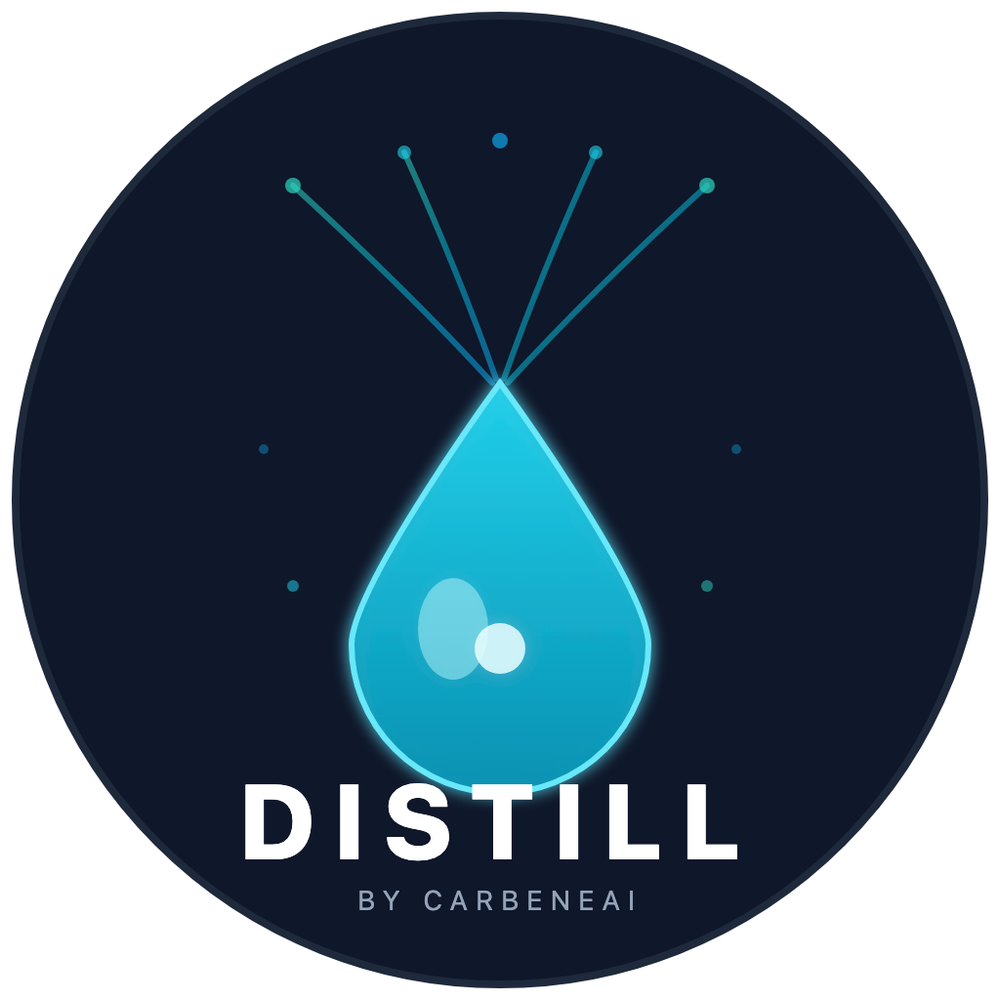
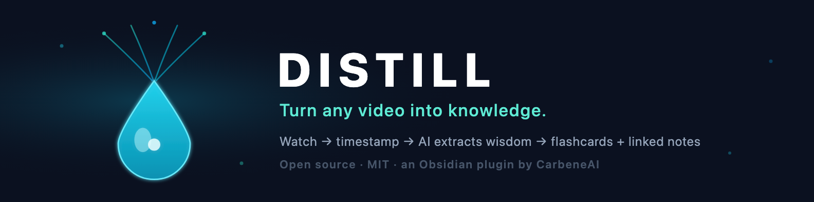

  
  <h1>Distill</h1>
  
<b>Turn any video into knowledge.</b>

An Obsidian plugin that watches a video with you, then distills it into a summary, extracted wisdom, timestamp-linked notes, and ready-to-review flashcards. All inside your vault.

## Why Distill

Most "AI summarize my YouTube" tools dump a wall of text and call it done. Distill is a different thing: a knowledge refinery. Raw video in, refined and *connected* knowledge out, built for the place your knowledge already lives.

The part nobody else does: **it turns the exact moments you flag into Anki flashcards and linked notes.** Watch a language video, mark the phrases you want, and Distill builds review cards from those timestamps. Go down a rabbit hole, and the people, claims, and ideas become linked notes in your graph.

## What it does

**1. A real media workstation**
- Resizable, pop-out player (no more tiny fixed embed)
- Playback speed and A‑B loop to replay a segment (great for language learning)
- Keyboard timestamps that drop a clickable marker; click to jump back to that exact second
- Frame screenshots straight into your note

**2. Timestamp-aware AI (powered by Fabric)**
- One **Process** button runs Fabric patterns (`summarize`, `extract_wisdom`, and more) on the transcript
- Every insight is anchored to a timestamp, one click from the source
- Run it on the whole video, or just the moments you flagged

**3. An output loop**
- Generate **Anki flashcards** from your timestamped highlights
- Auto-link people, concepts, and claims into atomic `[[notes]]` so every video enriches your graph
- Bring your own brain: cloud models, or a local Ollama for anything sensitive

## How it works

Distill is **post-hoc** by design. You watch the way you normally do, then process when you are ready. No live AI talking over your video.

1. Capture a video into your vault (bookmarklet, or paste a link)
2. Watch, take notes, drop timestamps
3. Hit **Process**: Distill pulls the transcript, runs your Fabric patterns, and writes it back into the note, timestamp-anchored
4. Optionally push highlights to Anki and link entities into your graph

## Roadmap

**v1 (MVP)**
- [ ] Media player: resize, pop-out, speed, A‑B loop, click-to-seek timestamps, frame screenshots
- [ ] Process button: `summarize` + `extract_wisdom`, timestamp-anchored
- [ ] Anki flashcards from timestamps
- [ ] Clean note titles, and clean URLs that always start at 0:00
- [ ] Bookmarklet to capture a video into your vault

**v1.1 and beyond**
- [ ] Graph auto-linking (entities / concepts / claims become atomic notes)
- [ ] More sources: podcasts, local recordings, articles
- [ ] Ask-the-source chat (retrieval over the transcript)
- [ ] Cross-video synthesis

## Tech

- Obsidian plugin (TypeScript)
- [Fabric](https://github.com/danielmiessler/fabric) patterns for the AI layer
- Cloud LLMs or a local Ollama
- Transcript fetch from the platform's caption track

## Install

Coming soon. This is in active development. Star the repo to follow along; it will land in the Obsidian Community Plugins browser once v1 ships.

## Support

Distill is free and open source under the MIT license. If it saves you time, you can fuel the build:

## Credits

Built by [CarbeneAI](https://carbene.ai). AI extraction powered by [Fabric](https://github.com/danielmiessler/fabric). MIT licensed.
